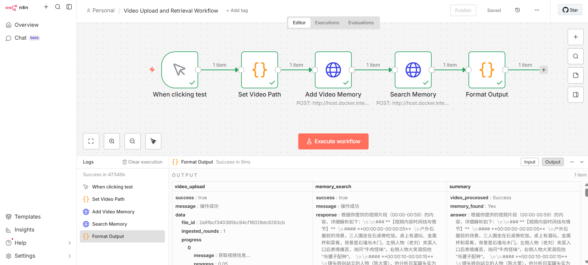

# MemContext n8n 插件

<div align="center">

**为 n8n 工作流提供多模态 Agent 记忆服务**

[](https://www.python.org/downloads/)
[](LICENSE)
[](https://n8n.io/)

*让您的 n8n 工作流拥有持久化记忆能力，支持文本、视频、音频、图像等多种模态* 

---

## 📖 简介

MemContext n8n Integration 是基于 [MemContext](README.md) 多模态 Agent 记忆框架开发的 n8n 插件服务。它通过 RESTful API 为 n8n 工作流提供强大的记忆管理能力，使您的自动化工作流能够：

- 🧠 **持久化记忆**：保存和检索对话历史，构建长期用户画像
- 🎬 **多模态处理**：支持视频、音频、图像、文档等多种格式的内容理解
- 🔍 **智能检索**：基于语义相似度的精准记忆检索
- ⚡ **即插即用**：无需复杂配置，通过 HTTP Request 节点即可调用

### 核心特性

- ✅ **三层记忆架构**：短期记忆、中期记忆、长期知识库
- ✅ **多模态支持**：文本、视频、音频、图像、文档的统一处理
- ✅ **RESTful API**：标准 HTTP 接口，易于集成
- ✅ **用户隔离**：基于 `user_id` 的多用户记忆管理
- ✅ **安全认证**：Bearer Token 认证机制

---

## 📋 前置要求

### 必需软件

- **Python 3.10+** - [下载地址](https://www.python.org/downloads/)
- **FFmpeg** - 用于视频/音频处理
  - Windows: `winget install FFmpeg`
  - macOS: `brew install ffmpeg`
  - Linux: `sudo apt install ffmpeg`
- **Docker Desktop** (可选) - 用于运行 n8n
  - Windows: `winget install Docker.DockerDesktop`
  - [其他平台](https://www.docker.com/products/docker-desktop/)

### 必需账号和密钥

- **LLM API Key** - OpenAI 或兼容 OpenAI API 的服务（如火山引擎）
- **n8n 平台** - 本地安装或云端实例

---

## 🚀 快速开始

### 步骤 1: 环境配置

#### 1.1 创建 Python 虚拟环境

```bash
conda create -n memcontext-n8n python=3.10 -y
conda activate memcontext-n8n
```

#### 1.2 安装依赖

```bash
# 在MemContext项目根目录执行
pip install -r requirements.txt
pip install -r ./memcontext-n8n/requirements.txt

# 如使用字节跳动火山引擎模型，还需安装
pip install volcengine-python-sdk[ark]
```

#### 1.3 安装系统依赖

```bash
# Windows
winget install FFmpeg
ffmpeg -version

winget install Docker.DockerDesktop
docker --version
```

### 步骤 2: 启动 n8n 服务

#### 2.1 使用 Docker 启动 n8n（推荐）

```bash
# 进入 memcontext-n8n 目录
cd memcontext-n8n

# 运行 Docker 启动脚本
docker-run-n8n.bat
```

脚本会自动检查 Docker 状态与端口占用，然后启动 n8n 容器并挂载本地目录

#### 2.2 访问 n8n

访问 http://localhost:5678 并登录

### 步骤 3: 配置环境变量

在**项目根目录**创建 `.env` 文件，示例如下：

```env
# ============================================
# LLM API 配置（必需）
# ============================================
LLM_API_KEY=YOUR-API-KEY
LLM_BASE_URL=https://ark.cn-beijing.volces.com/api/v3
LLM_MODEL=doubao-seed-1-6-flash-250828

# ============================================
# Embedding API 配置（用于向量数据库）
# ============================================
EMBEDDING_API_KEY=YOUR-API-KEY
EMBEDDING_BASE_URL=https://ark.cn-beijing.volces.com/api/v3
EMBEDDING_MODEL=doubao-embedding-large-text-250515

# ============================================
# SiliconFlow API 配置（可选，用于音频转录）
# ============================================
SILICONFLOW_API_KEY=YOUR-API-KEY
SILICONFLOW_MODEL=TeleAI/TeleSpeechASR
ENABLE_AUDIO_TRANSCRIPTION=true

# ============================================
# n8n API Key（必需，用于服务认证）
# ============================================
# 在 n8n 左下角 Settings → n8n API 中创建 API Key
N8N_API_KEY=YOUR-API-KEY
```

### 步骤 4: 启动 MemContext-n8n 插件服务

```bash
cd memcontext-n8n
python app.py
```

服务将在 `http://localhost:5019` 启动。

**验证服务运行**：

```bash
# 检查端口占用
netstat -ano | findstr :5019

# 或使用 curl 测试
curl http://localhost:5019
```

### 步骤 5: 创建工作流示例

#### 5.1 视频记忆工作流（自动化脚本）

```bash
cd memcontext-n8n

# 准备测试视频（约1分钟）
# 将视频命名为 test1.mp4 放在 memcontext-n8n 目录下

# 运行工作流创建脚本
create_video_workflow.bat
```

脚本会自动：

- ✅ 创建视频上传和检索工作流
- ✅ 配置所有节点
- ✅ 激活工作流

#### 5.2 在 n8n 中执行工作流

1. 访问 http://localhost:5678
2. 找到 "Video Upload and Retrieval Workflow"
3. 点击 "Execute Workflow" 运行
4. 查看执行结果

**预期输出**：
可以在下方看到整个流程的可视化示例：



- `video_upload.success`: `true`
- `memory_search.success`: `true`
- `summary.answer`: 包含视频内容描述
